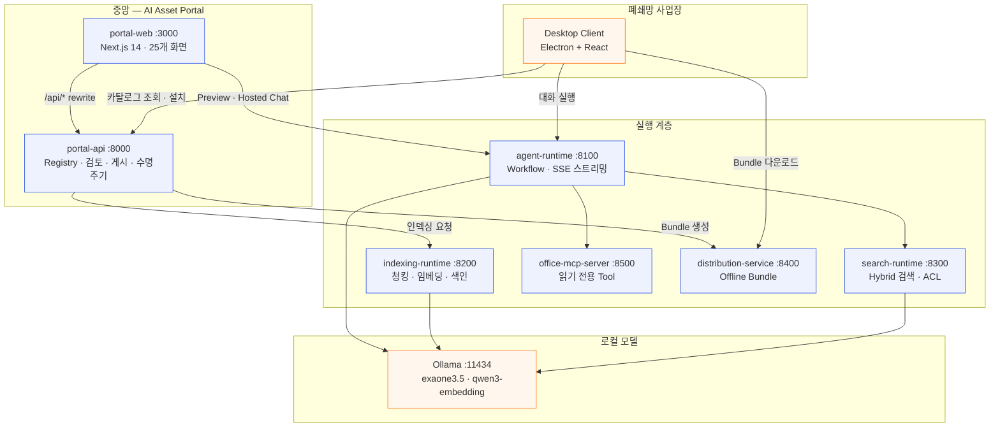
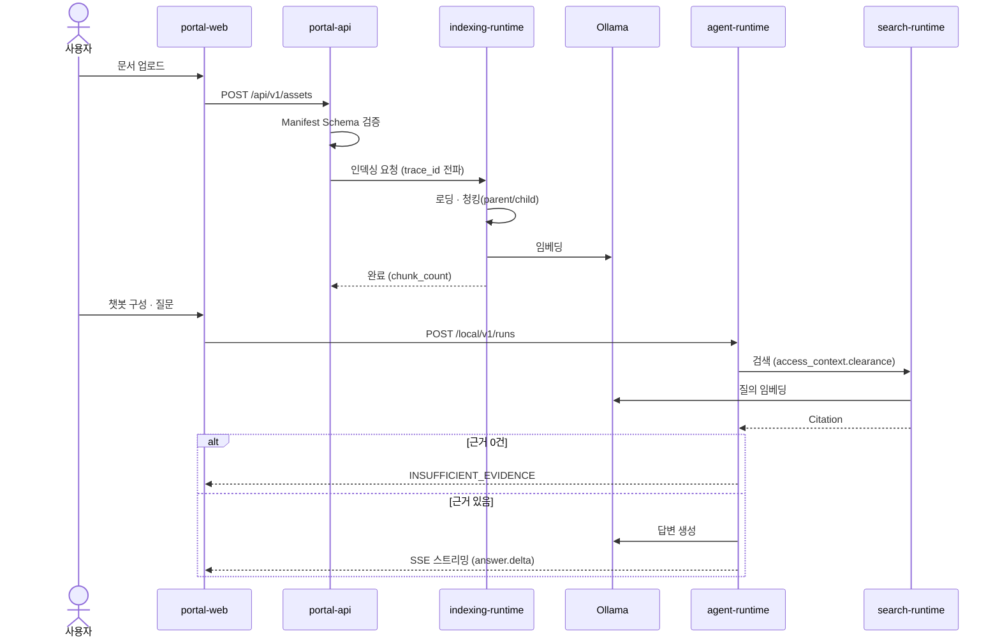
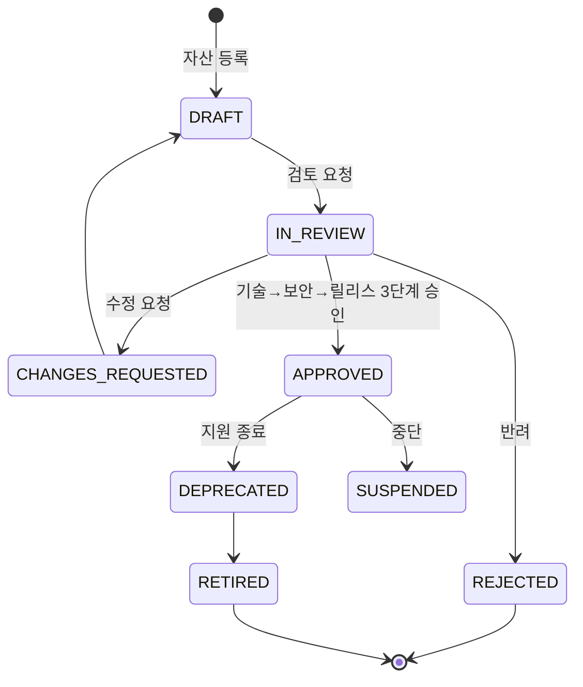
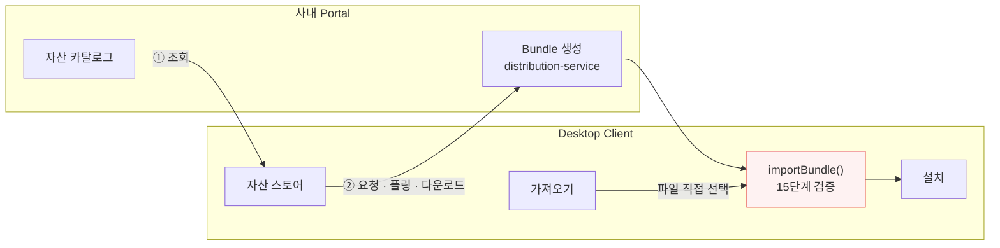

# 시스템 구조

이 문서는 **실제로 구현된 구조**를 기술한다. 모듈별 상세 명세는 [`implementation-spec/`](implementation-spec/)에 있다.

> 기획 단계 개념도는 [`assets/enterprise-ai-asset-hub-architecture.png`](../assets/enterprise-ai-asset-hub-architecture.png)에 남아 있다. 다만 그 그림은 `RAG Asset`·`Local RAG` 용어를 쓰는데, 이후 제품 언어를 `Knowledge`로 통일했다(`CLAUDE.md` 제품 언어). 현재 기준은 이 문서다.

---

## 1. 전체 구조

**런타임에 사내망 밖으로 나가는 호출은 없다.** 모든 서비스가 localhost로 물리고, LLM·임베딩은 로컬 Ollama를 쓴다.

---

## 2. 모듈 소유권

| ID | 경로 | 책임 |
|---|---|---|
| M01 | `apps/portal-web` | Portal UI, Catalog, Service Composer |
| M02 | `apps/portal-api` | Registry, Version, Review, Service/Deployment API |
| M03 | `services/distribution-service` | Repository, Download, Offline Bundle |
| M04 | `apps/desktop-client` | Desktop UI, Import, 자산 스토어 |
| M05 | `services/agent-runtime` | Workflow, Streaming, LLM/Knowledge/MCP 조정 |
| M06 | `packages/schemas` | Manifest/Profile/Service Schema와 Validator |
| M07 | `services/indexing-runtime` | Knowledge Indexing |
| M08 | `services/search-runtime` | Knowledge Search |
| M09 | `packages/knowledge-packager`, `packages/evaluation-runner` | Package와 평가 |
| M10 | `services/office-mcp-server` | Tool, Connector, 실행 통제 |
| M11 | `packages/security-policy` | RBAC, 승인, 무결성, 감사 정책 |
| M12 | `tests`, `docs` | 계약·통합·E2E·보안 테스트 |

모듈 간 **내부 폴더 직접 Import를 금지**한다. 공통 타입은 `packages/schemas` 또는 공개 API로 교환한다.

---

## 3. 지식 등록부터 대화까지

**근거가 없으면 LLM을 호출하지 않는다.** Citation이 0건이면 즉시 `INSUFFICIENT_EVIDENCE`로 종료해 할루시네이션을 막는다.

---

## 4. 거버넌스 — 등록에서 회수까지

- 검토는 **TECHNICAL → SECURITY → RELEASE 순차**이며 단계를 건너뛸 수 없다
- **승인된 버전은 수정할 수 없다** — 수정 시도는 `ASSET_STATE_TRANSITION_INVALID`
- **긴급 회수(Revocation)** 는 상태값이 아니라 별도 레코드다. 사유·승인자·효력 시각이 필수이며, 유효한 회수가 있으면 배포·다운로드가 차단된다
- 모든 변경과 **거부(DENIED)** 가 감사 로그에 남는다

---

## 5. 폐쇄망 배포 — 두 경로

두 경로 모두 **같은 검증기를 통과한다.** 스토어 설치는 별도 다운로드 경로를 만들지 않고, 받은 바이트를 기존 `importBundle()`에 그대로 넘긴다. 따라서 승인 버전 게이트·회수 차단·Checksum·Zip Slip·Zip Bomb·심볼릭 링크·실행 파일 정책이 두 경로에 동일하게 적용된다.

`가져오기`는 Portal에 접근조차 불가능한 완전 단절 장비를 위한 대체 경로다.

---

## 6. 검증 지점

| 지점 | 통제 |
|---|---|
| 자산 등록 | Manifest Schema 검증 |
| 검토 | 3단계 순차 승인, 자기 승인 금지, 사유 필수 |
| 게시 | 미승인 Knowledge 차단 |
| Knowledge 검색 | 보안등급 기반 ACL — 요청이 ACL 필드를 덮어쓸 수 없다 |
| Bundle 설치 | 15단계 검증(경로 안전성·Checksum·용량·실행 파일 등) |
| MCP Tool | 읽기 전용, Allowlist, 입력 검증, 사용자 확인 |
| 전 구간 | Trace ID 전파, 감사 로그(거부 포함) |

> **한계**: 사내 SSO가 연동되지 않아(D-001) search-runtime과 MCP Server에 인증이 없다. 따라서 `clearance`와 MCP 역할은 *주장된 값*이지 검증된 값이 아니다. 보안등급 ACL(D-062)은 메커니즘이며 완결된 통제가 아니다. 전체 한계는 [인수 보고서](implementation-spec/12-poc-acceptance-report.md) §10 참고.
